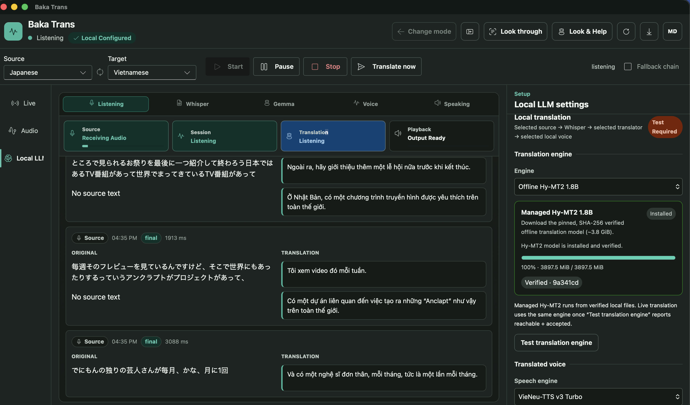

# Baka Trans

> Real-time meeting translation desktop app for macOS and Windows.

Baka Trans captures live meeting audio, transcribes it, translates the speech into another language, and plays the translated voice back into your headphones — all in near real time. It is designed for private, one-user listening so you can follow a foreign-language conversation without reading captions or interrupting other participants.

Built with **Tauri 2**, **React 18**, **TypeScript**, and **Rust**.


<div style="text-align: center;">
  
</div>

---

## Table of Contents

- [Features](#features)
- [Architecture](#architecture)
- [Prerequisites](#prerequisites)
- [macOS Environment Setup](#macos-environment-setup)
  - [Install BlackHole Virtual Audio](#install-blackhole-virtual-audio)
  - [Configure a Multi-Output Device (Optional)](#configure-a-multi-output-device-optional)
  - [Grant Microphone Permission](#grant-microphone-permission)
- [Development](#development)
- [Building with Make](#building-with-make)
- [Building the Installer](#building-the-installer)
- [Usage](#usage)
  - [Cloud API Mode](#cloud-api-mode)
  - [Local Whisper Mode](#local-whisper-mode)
- [Audio Routing](#audio-routing)
- [Windows](#windows)
- [Troubleshooting](#troubleshooting)
- [Project Structure](#project-structure)

---

## Features

### Real-Time Translation Pipeline

Capture live meeting audio, transcribe speech, translate it, synthesize translated voice, and play it back — all within 1–3 seconds for short utterances.

### Dual Translation Modes

| Mode | Description |
|---|---|
| **Cloud API** | Uses Google Gemini Live or OpenAI Realtime APIs for transcription, translation, and text-to-speech. High quality, requires API key and internet. |
| **Local Whisper** | Runs whisper.cpp on-device for Japanese transcription, then translates via offline Hy-MT2 engine or an OpenAI-compatible API (e.g. Ollama). No cloud translation key required. |

### Speech Engines

- **Cloud TTS** — Google or OpenAI speech synthesis via API.
- **System TTS** — macOS `say` service or Windows `Windows.Media.SpeechSynthesis` with installed system voices.
- **VieNeu-TTS** — Managed Vietnamese neural TTS runtime (ONNX/int8, ~244 MiB), downloaded in-app on first use.

### Audio Routing

- Captures meeting audio through **BlackHole 2ch** virtual audio device on macOS or **WASAPI loopback** on Windows.
- Split-channel output: original audio in one ear, translated audio in the other.
- Configurable input source, output device, and channel routing (all / left / right).
- Original audio monitoring with independent device and channel control.
- Auto-refreshing device list every 5 seconds.

### Live Transcript Display

- Real-time source and translated transcript with timestamps.
- Live status indicators: idle, listening, transcribing, translating, speaking, error.
- Export transcript as plain text or Markdown.

### Overlay Windows

- **Look Through** — Transparent OCR overlay for screen-reading assistance.
- **Look & Help** — Contextual help overlay with the same design system.

### Responsive UI

- Fluent 2 design system with light/dark theme support.
- Adaptive layout from 720px to 1440px+ widths.
- Persistent session controls and command bar.

### Security

- API keys stored in macOS Keychain or Windows Credential Manager.
- No raw audio persistence by default.
- Clear privacy indicators for cloud-sent data.

---

## Architecture

### High-Level Flow

```text
Meeting Audio (Teams, Zoom, etc.)
  → Virtual Audio Device (BlackHole 2ch / WASAPI loopback)
  → CPAL Audio Capture (PCM16 mono, 16 kHz)
  → Speech Recognition (whisper.cpp / Google Live / OpenAI Realtime)
  → Translation Engine (Hy-MT2 offline / OpenAI-compatible API / Google / OpenAI)
  → Text-to-Speech (Cloud TTS / System TTS / VieNeu-TTS)
  → PCM16 mono, 24 kHz
  → CPAL PlaybackRuntime
  → Selected output device and channel routing
  → Headphones
```

### Technology Stack

| Layer | Technology |
|---|---|
| Desktop shell | Tauri 2 (Rust backend, WebView frontend) |
| Frontend | React 18, TypeScript, Fluent UI v9, Vite |
| Backend | Rust, Tokio async runtime |
| Audio capture & playback | CPAL (Cross-Platform Audio Library) |
| Local speech recognition | whisper-rs (whisper.cpp bindings, Metal on macOS) |
| Translation | Google Gemini, OpenAI, Hy-MT2 offline, OpenAI-compatible APIs |
| TTS | Google TTS, OpenAI TTS, macOS `say`, Windows SpeechSynthesis, VieNeu-TTS |
| Sidecar runtimes | PyInstaller bundles (VieNeu-TTS bridge, Hy-MT runtime) |
| Credential storage | macOS Keychain / Windows Credential Manager via `keyring` |
| Screen OCR (macOS) | Apple Vision framework (`VNRecognizeTextRequest`) |

### Component Layout

```text
Frontend (React + TypeScript)
  ├── MainApp — session controller, event listeners, state management
  ├── Audio Routing — device selection, channel routing, monitoring
  ├── Transcript Panel — live source + translated text, export
  ├── Overlays — Look Through (OCR), Look & Help
  └── Settings — provider config, API keys, model management

Backend (Rust)
  ├── Audio Pipeline — CPAL capture, buffering, playback runtime
  ├── Transcription — whisper-rs local, Google Live WebSocket, OpenAI Realtime
  ├── Translation — provider abstraction (Google, OpenAI, Hy-MT2, OpenAI-compatible)
  ├── TTS — cloud APIs, platform TTS, VieNeu-TTS sidecar
  ├── Device Manager — enumeration, hot-plug detection
  └── Session State — lifecycle, pause/resume, error recovery
```

---

## Prerequisites

Before building or running Baka Trans, install these tools:

| Tool | Minimum | Install |
|---|---|---|
| **Node.js** | 20+ | <https://nodejs.org/> |
| **npm** | (bundled with Node.js) | — |
| **Rust & Cargo** | stable | `curl --proto '=https' --tlsv1.2 -sSf https://sh.rustup.rs \| sh -s -- -y` |
| **CMake** | 3.20+ | `brew install cmake` |
| **Xcode CLT** | (macOS only) | `xcode-select --install` |
| **uv** | (for sidecar builds) | <https://docs.astral.sh/uv/> |

CMake and a C/C++ toolchain are required because **whisper.cpp** is compiled from source during the Rust build.

Verify everything is installed:

```bash
make doctor
```

This checks for Node.js, npm, Cargo, rustc, CMake, Xcode CLT, uv, and optionally probes an OpenAI-compatible LLM endpoint if `LLM_BASE_URL` is set.

---

## macOS Environment Setup

### Install BlackHole Virtual Audio

Baka Trans captures meeting audio through **BlackHole 2ch**, a virtual audio driver that acts as a cable between your meeting app and Baka Trans.

#### Option A: Homebrew (Recommended)

```bash
brew install blackhole-2ch
```

Close and reopen audio apps after installation. Restart the Mac if the device does not appear.

#### Option B: Official Installer

1. Download **BlackHole 2ch** from the [official download page](https://existential.audio/blackhole/download/).
2. Close all audio apps (Teams, browsers, music players, Audio MIDI Setup).
3. Control-click the downloaded package → **Open** → follow the installer.
4. Restart the Mac if prompted.

#### Verify Installation

1. Press `⌘ + Space`, search for **Audio MIDI Setup**, open it.
2. Choose **Window → Show Audio Devices**.
3. Confirm **BlackHole 2ch** appears in the sidebar.

> **Note:** BlackHole is an audio driver, not an application — it does not appear in the Applications folder.

### Configure a Multi-Output Device (Optional)

Use a Multi-Output Device when you want Teams to send audio to both BlackHole and a physical speaker simultaneously:

1. Open **Audio MIDI Setup → Window → Show Audio Devices**.
2. Click `+` → **Create Multi-Output Device**.
3. Rename it (e.g. `Teams + BlackHole`).
4. Enable your headphones/speakers **and** BlackHole 2ch.
5. Set the physical output as the primary device.
6. Enable drift correction for non-primary devices.
7. Ensure all devices use the same sample rate (48.0 kHz recommended).
8. In Teams, set **Speaker** to this Multi-Output Device.

> **Tip:** macOS may disable keyboard volume controls for Multi-Output Devices. Adjust volume before the meeting.

### Grant Microphone Permission

macOS treats BlackHole as an input device, so Baka Trans needs microphone permission:

1. Open Baka Trans — macOS will prompt for microphone access.
2. Choose **Allow**.
3. If missed: **System Settings → Privacy & Security → Microphone → enable Baka Trans**.

---

## Development

Install dependencies and run in development mode:

```bash
npm ci
npm run tauri -- dev
```

This starts the Vite dev server on `http://localhost:1111` and launches the Tauri app with hot-reload.

Build only the frontend assets (without Tauri):

```bash
npm run build
```

Run tests:

```bash
npm test
```

---

## Building with Make

The Makefile provides two targets for streamlined development:

### `make doctor`

Verifies all required tools and runtime dependencies are present:

```bash
make doctor
```

Output:

```text
=== Baka Trans — environment check ===

[ toolchain ]
  ✓ node           v20.x.x
  ✓ npm            10.x.x
  ✓ cargo          cargo 1.xx.x
  ✓ rustc          rustc 1.xx.x
  ✓ cmake          cmake version 3.xx.x

[ platform ]
  ✓ xcode-clt      /Library/Developer/CommandLineTools
  ✓ uv             uv 0.x.x

[ runtime services ]
  · llm-api        skipped — set LLM_BASE_URL to probe an OpenAI-compatible API

=== summary ===
✓ environment looks good
```

To also probe a local LLM endpoint:

```bash
make doctor LLM_BASE_URL=http://localhost:11434/v1
```

### `make build`

Runs `doctor` first, then performs the full build pipeline:

```bash
make build
```

Steps executed:

1. **Sync JS dependencies** — `npm ci`
2. **Prefetch Rust dependencies** — `cargo fetch`
3. **Build VieNeu-TTS bridge** — PyInstaller sidecar (`scripts/build-vieneu-sidecar.sh`)
4. **Build Hy-MT runtime sidecar** — PyInstaller sidecar (`scripts/build-hy-mt-sidecar.sh`)
5. **Run Tauri build** — compiles Rust backend + bundles the `.app` and `.dmg`

Override the macOS deployment target if needed:

```bash
make build MACOSX_DEPLOYMENT_TARGET=11.0
```

> **Note:** The whisper-rs-sys CMake cache does not automatically pick up `MACOSX_DEPLOYMENT_TARGET` changes. `make build` handles this by detecting stale caches and running `cargo clean -p whisper-rs-sys` when needed (one-time ~15s cost).

---

## Building the Installer

Tauri produces platform-native installers. **Build on the OS you intend to ship.**

### macOS

```bash
npm ci
npm run tauri -- build
```

Build only the `.dmg`:

```bash
npm run tauri -- build --bundles dmg
```

Artifacts:

```text
src-tauri/target/release/bundle/macos/Baka Trans.app
src-tauri/target/release/bundle/dmg/Baka Trans_<version>_aarch64.dmg
```

### Windows

```powershell
npm ci
npm run release:windows
```

Artifacts:

```text
src-tauri\target\release\bundle\nsis\
```

Run Windows checks without building: `npm run release:windows:check`.

### Code Signing & Notarization

- Code signing is currently disabled for local development (`signingIdentity: null` in `tauri.macos.conf.json`).
- Public distribution requires Apple code signing and notarization.
- See [docs/RELEASE_GUIDE.md](docs/RELEASE_GUIDE.md) for the full macOS release workflow.
- See [docs/WINDOWS_RELEASE_GUIDE.md](docs/WINDOWS_RELEASE_GUIDE.md) for Windows.

---

## Usage

On launch, Baka Trans presents a mode chooser: **Cloud API** or **Local Whisper**.

### Cloud API Mode

Uses Google Gemini Live or OpenAI Realtime APIs for the full pipeline (transcription + translation + TTS).

1. Choose **Cloud API** → select **Google** or **OpenAI**.
2. Paste your API key → **Save** → **Test key**.
3. Set source and target languages.
4. Configure audio routing (see [Audio Routing](#audio-routing)).
5. Press **Start**.

### Local Whisper Mode

Runs whisper.cpp locally for Japanese transcription, then translates via Hy-MT2 (offline) or an OpenAI-compatible API. Does **not** require a cloud translation key.

1. Choose **Local Whisper** → open **Local LLM**.
2. Select a translation engine:
   - **Hy-MT2** — offline, no network required (quality gate: CAUTION for live sessions).
   - **OpenAI-compatible API** — configure base URL, model name, and API key (e.g. Ollama at `http://localhost:11434/v1`).
3. Select a Whisper model → **Download model** (stored in app data folder).
4. Choose a speech engine:
   - **System TTS** — install a Vietnamese voice in system settings.
   - **VieNeu-TTS** — **Install VieNeu-TTS** (downloads ~244 MiB ONNX model).
5. Configure voice, rate, and volume → **Save** → **Test local pipeline**.
6. Configure audio routing → **Start**.

> **Default segmentation:** 300 ms min speech, 700 ms trailing silence, 15 s max utterance, 250 ms pre-roll, 0.015 RMS threshold. Raise the threshold in noisy rooms.

### Error Reference

| Code | Action |
|---|---|
| `local_whisper_model_unreadable` | Select an existing, readable GGML model file. |
| `local_whisper_model_load_error` | Verify the file is a compatible, non-empty whisper.cpp model. |
| `local_openai_request_error` | Check the OpenAI-compatible endpoint URL and network. |
| `local_openai_provider_error` | Verify model name and API key, then retry. |
| `local_hy_mt2_not_available` | Hy-MT2 not enabled for live sessions yet; use OpenAI-compatible engine. |
| `local_translation_backlog_full` | Use shorter utterances, a smaller model, or more capable hardware. |
| `vieneu_model_not_installed` | Open Local LLM → **Install VieNeu-TTS**. |
| `vieneu_install_failed` | **Resume setup** — existing verified data is reused. |
| `vieneu_start_failed` | **Repair** or **Restart VieNeu-TTS** in Local LLM. |
| `local_tts_voice_missing` | Refresh and reselect the voice, save, and retest. |
| `local_tts_backlog_full` | Reduce model latency or pause until speech catches up. |
| `local_tts_playback_error` | Reconnect and reselect the output device. |

---

## Audio Routing

### How It Works

```text
Remote participant in meeting app
  → Meeting Speaker: BlackHole 2ch
  → Baka Trans Meeting source: BlackHole 2ch
  → real-time translation
  → Baka Trans Translated audio: your headphones
```

Your microphone follows a separate path — it goes directly to the meeting app, not through Baka Trans.

### Recommended Headset Setup

Use one stereo headset with split channels for private listening:

| Setting | Value |
|---|---|
| Meeting app Speaker | `BlackHole 2ch` |
| Meeting app Microphone | Your real headset/microphone |
| Baka Trans Meeting source | `BlackHole 2ch` |
| Baka Trans Translated audio | Your headphones |
| Baka Trans Translated channel | `Right ear` |
| Baka Trans Original audio monitor | On |
| Baka Trans Monitor output | Same headphones |
| Baka Trans Original channel | `Left ear` |

> **Warning:** Never set the meeting app microphone to BlackHole — this creates echo/feedback.

### Pre-Meeting Checklist

- [ ] Headphones connected
- [ ] BlackHole 2ch visible in Audio MIDI Setup
- [ ] Baka Trans has microphone permission
- [ ] API key configured and tested (Cloud mode)
- [ ] Source and target languages are different
- [ ] Meeting app speaker set to BlackHole 2ch
- [ ] Meeting app microphone set to real microphone
- [ ] Baka Trans meeting source is BlackHole 2ch
- [ ] **Test translated** plays audio in the correct ear
- [ ] **Test original** plays audio in the correct ear
- [ ] Input meter moves when meeting audio plays

For the full routing guide, see [docs/BLACKHOLE_TEAMS_USER_GUIDE.md](docs/BLACKHOLE_TEAMS_USER_GUIDE.md).

---

## Windows

Windows uses built-in **WASAPI loopback capture** — no virtual audio driver is required for the default workflow. VB-CABLE is only a troubleshooting fallback.

Requirements:

- Windows 10/11
- Node.js, Rust, CMake, `uv`
- Microsoft Visual Studio Build Tools (with C++ Desktop Development)

Build:

```powershell
npm ci
npm run release:windows
```

See [docs/WINDOWS_TEAMS_USER_GUIDE.md](docs/WINDOWS_TEAMS_USER_GUIDE.md) for the full Windows setup guide.

---

## Troubleshooting

| Symptom | Fix |
|---|---|
| BlackHole does not appear | Confirm in Audio MIDI Setup, restart Teams and Baka Trans. Restart Mac if just installed. |
| **Start** button disabled | Save API key, select meeting source and output device, stop test tones/monitoring. |
| Input shows **Waiting** or **No recent audio** | Confirm meeting app speaker is BlackHole, audio is playing, and Baka Trans has mic permission. |
| Input shows **Source silent** | Route is connected but no one is speaking. Check meeting app output level. |
| Input shows **Capture error** | Stop session, close apps holding the device, refresh device list, reselect BlackHole. |
| No original audio heard | Expected when meeting app sends only to BlackHole. Enable Original audio monitor or use Multi-Output Device. |
| Translated audio not heard | Stop → **Test translated** → confirm correct headphones, channel, and volume. |
| Other participants hear echo | Confirm meeting mic is real microphone, not BlackHole. Use headphones. |
| Audio crackles with Multi-Output | Use same sample rate for all devices, enable drift correction. |
| API key test fails | Confirm provider matches key, account has quota, and Mac has internet. |
| whisper.cpp build fails | Ensure CMake and Xcode CLT are installed. Run `make doctor` to check. |

---

## Project Structure

```text
baka-trans/
├── src/                    # React + TypeScript frontend
│   ├── app/                # MainApp, routing, session controller
│   ├── components/         # UI components (shell, session, overlays)
│   ├── styles/             # CSS (app, overlays, legacy compatibility)
│   ├── api.ts              # Tauri native command wrappers
│   ├── transcript.ts       # Transcript merging, derivation, export
│   ├── languages.ts        # Provider language rules
│   └── types.ts            # Backend data contracts
├── src-tauri/              # Rust backend
│   ├── src/                # Audio pipeline, transcription, translation, TTS
│   ├── Cargo.toml          # Rust dependencies
│   └── tauri.conf.json     # Tauri configuration
├── sidecars/               # PyInstaller bundled runtimes
│   ├── vieneu-tts/         # VieNeu-TTS bridge
│   └── hy-mt/              # Hy-MT translation runtime
├── scripts/                # Build and release automation
├── docs/                   # Guides, release notes, design docs
├── Makefile                # doctor + build targets
├── package.json            # Node.js dependencies and scripts
└── vite.config.ts          # Vite bundler configuration
```

---

## License

See [LICENSE](LICENSE) for details.

---

## Links

- [BlackHole Project](https://github.com/ExistentialAudio/BlackHole)
- [whisper.cpp](https://github.com/ggml-org/whisper.cpp)
- [Tauri Documentation](https://v2.tauri.app/)
- [Fluent UI React v9](https://react.fluentui.dev/)
- [BlackHole + Teams User Guide](docs/BLACKHOLE_TEAMS_USER_GUIDE.md)
- [macOS Release Guide](docs/RELEASE_GUIDE.md)
- [Windows User Guide](docs/WINDOWS_TEAMS_USER_GUIDE.md)
