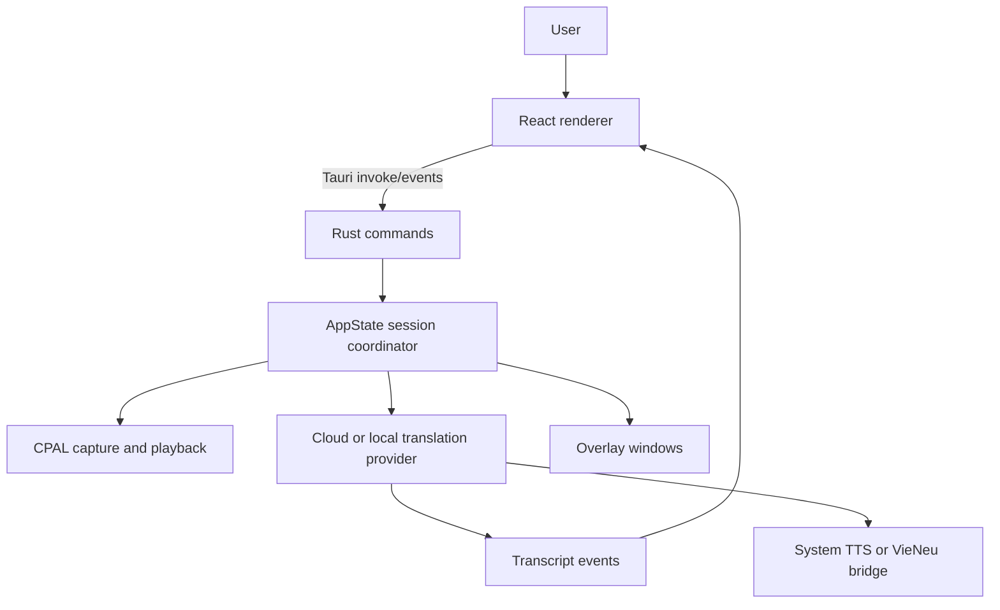

<cite>
- src/main.tsx
- src/App.tsx
- src/app/MainApp.tsx
- src-tauri/src/lib.rs
- src-tauri/src/session.rs
- src-tauri/src/ai.rs
- src-tauri/src/audio.rs
</cite>

# System Architecture

## Table of Contents

- [Introduction](#introduction)
- [Runtime topology](#runtime-topology)
- [Translation flow](#translation-flow)
- [Extension points](#extension-points)

## Introduction

**Verified.** The application pairs a React renderer with a Rust/Tauri host. The renderer selects main or overlay routes; the host registers Tauri commands and owns sessions, audio resources, credentials, provider clients, and window state.

## Runtime topology

**Verified.** `src-tauri/src/lib.rs` registers the command handler; `AppState` controls capture, playback, session status, and transcript state. The renderer calls commands through `src/api.ts` and listens to Tauri events.

## Translation flow

**Verified.** A session validates languages and audio routing, captures source audio, routes it to the selected provider, then emits transcript updates and session state. The available provider strategies are OpenAI Realtime, Google Live Translation, and local Whisper plus Ollama. Local mode performs speech recognition and text translation before TTS playback.

## Extension points

**Verified.** Translation selection is represented by `TranslationProvider`; local speech output is represented by `LocalTtsProvider`; meeting summaries use persisted `LlmProviderProfile` records. These are application-owned provider abstractions, not a third-party plugin registry.
