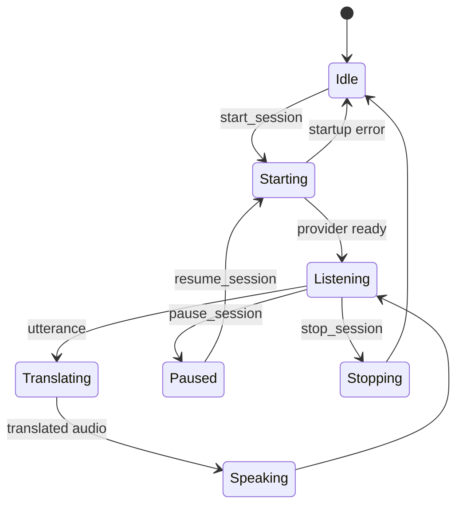

<cite>
- README.md
- src-tauri/src/session.rs
- src-tauri/src/ai/openai_realtime.rs
- src-tauri/src/ai/google_live.rs
- src-tauri/src/ai/local_whisper_ollama.rs
- src-tauri/src/local_translation.rs
- src-tauri/src/tts.rs
- src-tauri/src/vieneu.rs
</cite>

# Translation and Speech Pipelines

## Table of Contents

- [Provider strategies](#provider-strategies)
- [Session lifecycle](#session-lifecycle)
- [Local path](#local-path)
- [Recovery](#recovery)

## Provider strategies

**Verified.** The provider enum selects OpenAI Realtime, Google Live Translation, or Local Whisper + Ollama. Cloud providers require credentials; local translation validates its runtime configuration instead.

## Session lifecycle

**Verified.** `AppState` rejects a second active session, checks source/target and routing settings, clears state on startup failure, and allows pause/resume/stop with status events.

## Local path

**Verified.** Local mode accepts 16 kHz mono PCM, uses Whisper recognition, calls Ollama's `/api/chat`, then synthesizes Vietnamese speech with system TTS or VieNeu. The local configuration validates model readability, model response, voice availability, and output routing before use.

## Recovery

**Verified.** Model download/installation reports progress. VieNeu verifies expected model artifacts; runtime status includes recovery and repair phases. Session and local pipeline failures are emitted as structured application errors; exact error codes are documented in the README.
