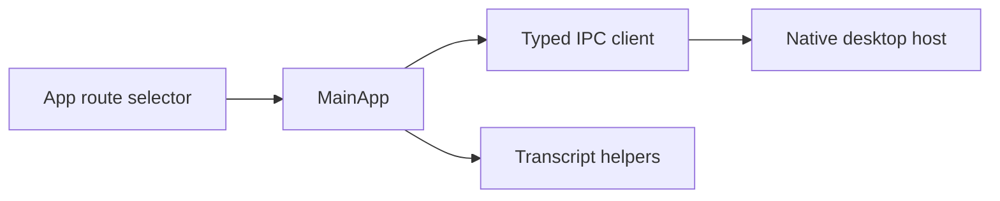

# Frontend architecture

`src/api.ts` presents one typed function per Tauri command. `MainApp.tsx` coordinates the workspace: it starts/stops sessions, opens overlays, edits configuration, and listens for native status/transcript events. `transcript.ts` contains pure merge and rendering helpers, which isolates user-visible state transformations from UI components.

