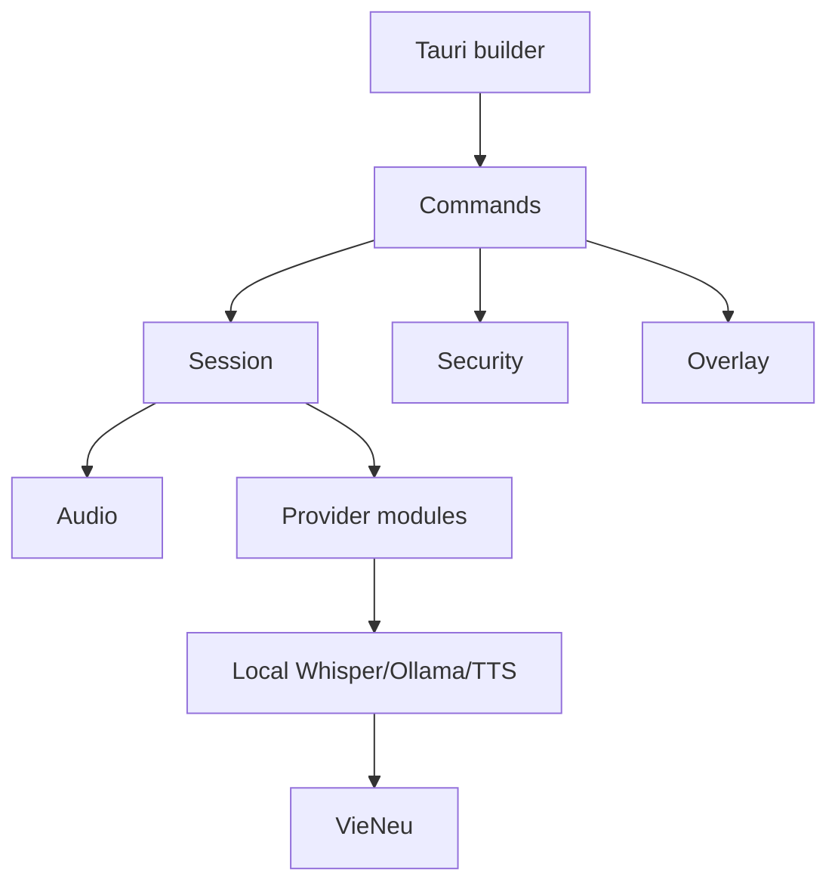

# Native desktop architecture

`lib.rs` registers an `AppState`, overlay state, Look & Help state, and a VieNeu manager with Tauri. `commands.rs` translates IPC requests to these subsystems. `session.rs` implements lifecycle guards and provider dispatch; `models.rs` defines the serialized values shared with the renderer.

