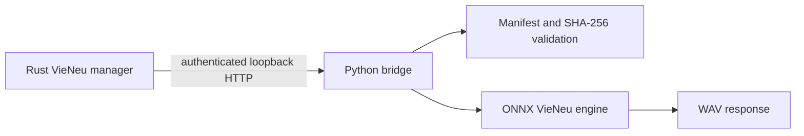

# VieNeu sidecar architecture

The bridge has two modes: installation verifies pinned artifact versions and checksums; serving loads the model and accepts authenticated health, voice-list, and synthesis requests. It serializes inference behind a lock and returns WAV PCM audio.

